# Varta

<p align="center">
  
</p>

<p align="center">
  <a href="https://github.com/aramirez087/Varta/actions/workflows/ci.yml">
    
  </a>
  
  
  
</p>

**Zero dependencies. Zero allocations. Agents that never go dark.**

A 32-byte heartbeat protocol for distributed local agents and networked clusters. Your processes talk; Varta listens.

## Why Varta

- **Zero dependencies.** Production crates carry an empty `[dependencies]`
  section. No `tokio`, no `serde`, no `libc`. Drop in one path dep and get
  health signalling.
- **Zero steady-state allocation.** After `Varta::connect`, every `beat()`
  call operates on a stack buffer. Verified by a guard-allocator test in
  `varta-tests`.
- **Sub-microsecond beat path.** The steady-state `beat()` encodes a 32-byte
  frame and hands it to `send(2)`. See [benchmark results](book/src/benchmarks/results.md)
  for measured numbers.
- **Non-blocking by design.** The agent socket is set to non-blocking at
  connect time. A missing or busy observer surfaces as `BeatOutcome::Dropped`
  — never a stall in your hot path.

## Official clients

| Language | Package                | Status | Source                       |
| -------- | ---------------------- | ------ | ---------------------------- |
| Rust     | `varta-client` (path)  | Stable | [`crates/varta-client/`](crates/varta-client/) |
| Python   | `pip install varta`    | Beta   | [`clients/python/`](clients/python/) |
| Go       | _planned_              |        |                              |
| Node.js  | _planned_              |        |                              |

The wire protocol (`VLP v0.2`) is governed by
[`book/src/spec/`](book/src/spec/) and the cross-language conformance
suite at
[`tools/vlp-test-vectors.json`](tools/vlp-test-vectors.json). Every
official client is verified against the same vectors. See
[`clients/README.md`](clients/README.md) for the multi-language
adoption pattern.

## Install

Varta is not yet published to crates.io (post-v0.1.0). Use a path dependency:

```toml
[dependencies.varta-client]
path = "path/to/varta/crates/varta-client"
```

To enable the optional panic hook or UDP transport:

```toml
[dependencies.varta-client]
path = "path/to/varta/crates/varta-client"
features = ["panic-handler", "udp"]
```

> **Building a client in another language?** The VLP wire format is
> documented as a language-neutral specification at
> [`book/src/spec/vlp.md`](book/src/spec/vlp.md) (plus
> [`vlp-secure.md`](book/src/spec/vlp-secure.md) for the AEAD-wrapped
> transport). A cross-language conformance vector suite ships at
> [`tools/vlp-test-vectors.json`](tools/vlp-test-vectors.json); Python,
> C99, and Go reference verifiers live in
> [`tools/reference-implementations/`](tools/reference-implementations/).
> Production-grade client libraries live in
> [`clients/`](clients/).

## Quickstart

```rust,no_run
use varta_client::{BeatOutcome, Status, Varta};

fn main() -> std::io::Result<()> {
    // One allocation: opens the socket.
    let mut agent = Varta::connect("/tmp/varta.sock")?;
    // For network-based agents, enable the `udp` feature:
    // let mut agent = Varta::connect_udp("192.168.1.100:9000")?;

    loop {
        // Zero allocation: encodes on the stack, hands to send(2).
        match agent.beat(Status::Ok, 0) {
            BeatOutcome::Sent    => {}
            BeatOutcome::Dropped => { /* observer absent — safe to continue */ }
            BeatOutcome::Failed(e) => eprintln!("beat: {e}"),
        }
        std::thread::sleep(std::time::Duration::from_millis(500));
    }
}
```

Start the observer in a separate terminal:

```sh
varta-watch \
  --socket /tmp/varta.sock \
  --udp-port 9000 \
  --threshold-ms 2000 \
  --prom-addr 127.0.0.1:9100
```

Then inspect the metrics:

```sh
curl -s -H "Authorization: Bearer $(cat /etc/varta/prom.token)" \
  http://127.0.0.1:9100/metrics
```

## Production monitoring

A turn-key Prometheus + Grafana + Alertmanager bundle ships at
[`observability/`](observability/) — alert rules, recording rules, a
24-panel Grafana dashboard, and ready-to-paste systemd / Docker /
Kubernetes manifests. See [`observability/README.md`](observability/README.md)
for the load order or
[`book/src/operations/monitoring.md`](book/src/operations/monitoring.md)
for the operator-facing prose.

| `varta-watch` | [README](crates/varta-watch/README.md) | Observer binary — stall detection, file export, Prometheus. |

## Examples

| Example | Feature | Description |
|---------|---------|-------------|
| [`basic`](crates/varta-client/examples/basic.rs) | - | Minimal UDS heartbeat loop. |
| [`with_payload`](crates/varta-client/examples/with_payload.rs) | - | Heartbeat with 16-byte custom payload. |
| [`udp`](crates/varta-client/examples/udp.rs) | `udp` | Heartbeat over network (UDP). |
| [`secure_udp`](crates/varta-client/examples/secure_udp.rs) | `secure-udp` | Encrypted heartbeats (ChaCha20-Poly1305). |
| [`with_panic_handler`](crates/varta-client/examples/with_panic_handler.rs) | `panic-handler` | Automatic `Critical` beat on Rust panic. |

## Performance

Benchmark results are in [book/src/benchmarks/results.md](book/src/benchmarks/results.md).
The steady-state `beat()` path is designed to be invisible at runtime: one
stack encode, one `send(2)`, no allocations.

## Security

Varta is built for high-assurance environments.
- [**Formal Threat Model**](book/src/architecture/threat-model.md) — STRIDE analysis, trust boundaries, and mitigations.
- [**Security Policy**](SECURITY.md) — reporting vulnerabilities.

## Constraints

- **No registry dependencies** in any production crate.
- **No heap allocation** after `Varta::connect` in the steady-state beat path.
- **No blocking** — `WouldBlock` is treated as `Dropped`, never as an error
  that stalls the caller.
- **MSRV** — Minimum Supported Rust Version is **1.70.0**.
- **Edition 2021**, pinned toolchain via `rust-toolchain.toml`.
