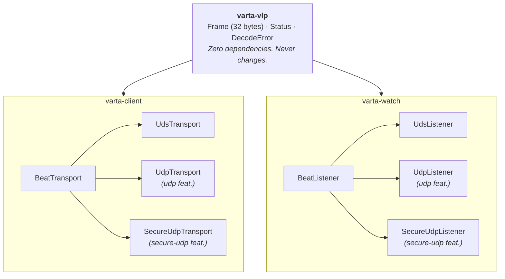

# VLP Transports

> **Audience: Rust contributors.** This page documents the *Rust
> implementation* of the VLP transport layer — trait shapes, feature-flag
> matrix, operational guidance. For the normative wire format of the base
> frame and the AEAD-wrapped secure frames, see the
> [VLP specification](../spec/vlp.md) and
> [VLP secure-transport specification](../spec/vlp-secure.md).

The Varta Lifeline Protocol (VLP) wire format is entirely transport-agnostic — a 32-byte,
8-byte-aligned `#[repr(C)]` frame. The transport layer is abstracted via traits that
allow swapping out the underlying socket type without modifying the protocol core.

## Architecture



### Agent side (`varta-client`)

```rust
pub trait BeatTransport: Send + 'static {
    fn send(&mut self, buf: &[u8; 32]) -> io::Result<usize>;
    fn reconnect(&mut self) -> io::Result<()>;
}
```

`Varta<T: BeatTransport>` owns a transport and calls `send(2)` on every `beat()`.
The default transport is `UdsTransport` (Unix Domain Socket). When the `udp`
feature is enabled, `UdpTransport` is available via `Varta::connect_udp(addr)`.
When the `secure-udp` feature is enabled, `SecureUdpTransport` is available
via `Varta::connect_secure_udp(addr, key)` — every beat is encrypted with
ChaCha20-Poly1305 AEAD (RFC 8439).

### Observer side (`varta-watch`)

```rust
pub trait BeatListener: Send + 'static {
    fn recv(&mut self) -> RecvResult;
    fn drain_decrypt_failures(&mut self) -> u64 { 0 }  // default = 0
    fn drain_truncated(&mut self) -> u64 { 0 }         // default = 0
}
```

The `Observer` holds a `Vec<Box<dyn BeatListener>>` and polls all listeners
round-robin on each `poll()` call. When `--udp-port` is passed at the CLI,
a `UdpListener` is added alongside the UDS listener.

## Transport comparison

| | UDS (default) | UDP (feature = "udp") | Secure UDP (feature = "secure-udp") |
|---|---|---|---|---|
| **Addressing** | Filesystem path | `IP:PORT` | `IP:PORT` |
| **Encryption** | None (kernel isolation) | None | ChaCha20-Poly1305 AEAD |
| **Authentication** | Kernel PID + UID via `SO_PASSCRED` / `SCM_CREDS` where available; socket permissions only on macOS pathname UDS | None | Poly1305 tag + PID in IV prefix (master-key mode) — wire-content only, not the sending process |
| **Replay protection** | None (local IPC) | None | Per-sender IV counter monotonicity |
| **Trust model** | Filesystem permissions + kernel credential attestation on supported kernels | Network segmentation | 256-bit pre-shared or per-agent derived key |
| **Origin classification** | `KernelAttested` on Linux / supported BSDs / illumos / Solaris; `SocketModeOnly` on macOS pathname UDS | `NetworkUnverified` | `NetworkUnverified` (cryptographic binding != kernel attestation) |
| **Recovery-eligible by default?** | **Yes where kernel-attested; no on socket-mode-only targets** | **No** (see [peer-authentication.md → Recovery eligibility]) | **No** (same gate; even master-key derivation cannot replace kernel attestation) |
| **Frame size** | 32 bytes | 32 bytes | 60 bytes (AEAD overhead) |
| **Socket cleanup** | `UdsListener::drop` unlinks socket | Kernel reclaims port | Kernel reclaims port |
| **Use case** | Local IPC, process monitoring | IoT/edge, microservices | Anything crossing untrusted networks |

> **Recovery-on-UDP is structurally rejected by default.** Combining any
> recovery flag (`--recovery-exec` / `--recovery-exec-file`) with
> `--udp-port` is a startup hard-error unless the operator passes
> `--i-accept-recovery-on-unauthenticated-transport`.  Even with the flag,
> the runtime origin gate still refuses to fire recovery for UDP-origin
> stalls — flipping `Recovery::with_allow_unauthenticated_source(true)` is
> a separate, conscious choice.  See
> `book/src/architecture/peer-authentication.md` for the full threat model.

## CLI additions

```bash
# Listen on UDS only (default)
varta-watch --socket /tmp/varta.sock --threshold-ms 500

# Listen on UDS + UDP (requires --features udp at build time)
varta-watch --socket /tmp/varta.sock --threshold-ms 500 \
            --udp-port 9000 --udp-bind-addr 0.0.0.0

# UDP-only (no UDS)
varta-watch --socket /tmp/varta.sock --threshold-ms 500 \
            --udp-port 9000

# UDP with ChaCha20-Poly1305 encryption
# Generate a 256-bit key (64 hex chars)
openssl rand -hex 32 > /tmp/varta.key

varta-watch --socket /tmp/varta.sock --threshold-ms 500 \
            --udp-port 9000 --key-file /tmp/varta.key

# Rotation: accept old key while transitioning to new key
openssl rand -hex 32 > /tmp/varta-new.key
varta-watch --socket /tmp/varta.sock --threshold-ms 500 \
            --udp-port 9000 --key-file /tmp/varta.key \
            --accepted-key-file /tmp/varta-new.key

# Per-agent key derivation from master key
# The observer derives agent-specific keys from the PID embedded in
# each frame's iv_random prefix. Compromise of one agent's key does
# not reveal other agents' keys or the master key.
openssl rand -hex 32 > /tmp/varta-master.key
varta-watch --socket /tmp/varta.sock --threshold-ms 500 \
            --udp-port 9000 --master-key-file /tmp/varta-master.key
```

## Feature flags

| Crate | Flag | Effect |
|---|---|---|
| `varta-vlp` | `crypto` | Enables ChaCha20-Poly1305 AEAD (`seal`, `open`, `Key`). No_std-compatible — all four RustCrypto deps are `default-features = false`. |
| `varta-vlp` | `std` | Opt-in std-dependent conveniences (`Key::from_file`, `std::path::Path`-typed helpers). **Off by default** so the crate is `#![no_std]` + alloc-free out of the box — ready for FreeRTOS/Zephyr targets. |
| `varta-client` | `udp` | Enables `UdpTransport`, `Varta::connect_udp()`, `install_panic_handler_udp()` |
| `varta-client` | `secure-udp` | Enables `SecureUdpTransport`, `Varta::connect_secure_udp()`; implies `udp`, `varta-vlp/crypto`, and `varta-vlp/std` (the `secure_udp` example calls `Key::from_file`). |
| `varta-watch` | `udp` | Enables `UdpListener`, `--udp-port` / `--udp-bind-addr` CLI flags |
| `varta-watch` | `secure-udp` | Enables `SecureUdpListener`, `--key-file` / `--accepted-key-file` / `--master-key-file`; implies `udp-core` |
| `varta-tests` | `udp` | Enables UDP integration tests |
| `varta-bench` | `udp` | Enables `udp-latency` benchmark subcommand |

## Security

- **UDS**: On Linux, the kernel attests the sender's PID and UID via
  `SCM_CREDENTIALS`. The observer rejects frames where `frame.pid != peer_pid`
  or `peer_uid != observer_uid`. Linux recovery eligibility also requires the
  observer to pin the sender's `/proc/<pid>/stat` start-time generation before
  first contact can become `KernelAttested`; an unpinned first-contact beat is
  tracked as `SocketModeOnly`. On macOS pathname datagram sockets,
  `LOCAL_PEERTOKEN` requires a connected local socket and the observer falls
  back to `--socket-mode 0600`. On other platforms without per-datagram
  credentials, the only defence is `--socket-mode`.

- **UDP (plaintext)**: No kernel credential mechanism exists. `peer_pid` is
  always 0, which causes the observer to skip PID verification. Trust must be
  established at the network layer — firewall rules, VPC boundaries.

- **UDP (secure)**: Every frame is encrypted with ChaCha20-Poly1305 (RFC 8439)
  using a 256-bit key. Primitives are provided by the `chacha20poly1305` crate
  (RustCrypto, NCC Group audit 2020) — no hand-rolled crypto. Key derivation
  uses HKDF-SHA256 (RFC 5869) via the `hkdf` + `sha2` crates. Two key modes:
  - **Shared key**: A single pre-shared key for all agents (`--key-file`).
  - **Master key**: Per-agent keys derived from the agent's PID via HKDF-SHA256
    (`--master-key-file`). The PID is embedded in the `iv_random` prefix so
    the observer can derive the correct agent key before decryption. Compromise
    of one agent's key does not reveal other agents' keys or the master key.
    **Note:** the HKDF-based KDF is incompatible with the ChaCha20-PRF KDF used
    in earlier releases — agents must re-key when upgrading from a pre-RustCrypto
    build if master-key mode was in use.
  - Replay attacks are blocked by enforcing monotonic IV counters per sender.
    Key rotation is supported via `--accepted-key-file` (no downtime required).
  - **Panic-hook entropy**: `install_panic_handler_secure_udp` reads all IV
    material at install time and **fails closed** if the entropy chain
    (`getrandom`, `getentropy`, `/dev/urandom`) is unavailable. Forked-child
    panic prefixes are derived from that pre-read salt with HKDF, so the hook
    never calls the OS entropy chain. In chrooted environments without `/dev`,
    use `install_panic_handler_secure_udp_accept_degraded_entropy` to opt into
    a non-cryptographic fallback — see
    `book/src/architecture/peer-authentication.md` for the full nonce-reuse
    risk analysis.

- **Recovery commands**: Exec mode only (shell mode was permanently removed):
  - `--recovery-exec`: Command executed directly via `execvp(2)` with `{pid}`
    replaced in arguments; the pid is also appended as the final argument.
    No shell is involved.
  - `--recovery-exec-file`: Read the program + args from a hardened file
    with mandatory ownership/permission checks (UID match, mode ≤ 0600).

## Container / PID-namespace semantics

`Frame.pid` carries the agent's PID **in the agent's PID namespace**. The
observer's kernel-attested peer PID (`SO_PASSCRED` / `SCM_CREDS`) is in the
**observer's** namespace. When the two namespaces
differ:

- The pid in the frame cannot be used to identify a process the observer can
  `kill(2)` or `systemctl restart` — the same numeric PID refers to a different
  process in each namespace.
- The existing `frame.pid == peer_pid` check at observer ingress catches most
  cases (different namespaces usually produce different numeric pids), but
  same-pid collisions across containers (every container's first process is
  PID 1) are invisible to that gate.

`varta-watch` therefore (Linux only):

1. Reads `/proc/self/ns/pid` once at startup and caches the inode as the
   observer's namespace identity.
2. For every kernel-attested beat (UDS), reads `/proc/<peer_pid>/ns/pid` and
   compares the inode to the observer's. Mismatch ⇒ drop the beat
   (`varta_frame_namespace_mismatch_total++`) and emit
   `Event::NamespaceConflict`.
3. Per-pid tracker slots pin the namespace inode at first beat; a later beat
   with a different `Some(_)` inode is rejected as `Update::NamespaceConflict`
   (`varta_tracker_namespace_conflict_total++`).
4. Recovery commands refuse to spawn for cross-namespace stalls and log an
   audit record with `reason=cross_namespace_agent`
   (`varta_recovery_refused_total{reason="cross_namespace_agent"}++`).

### Escape hatch — `--allow-cross-namespace-agents`

When agents are intentionally run with `--pid=host` (containers sharing the
host PID namespace), the observer's namespace and the agents' namespace agree
at the kernel level — the gate above is a no-op.

For deployments where the agent runs in a private namespace **and** the
operator has out-of-band PID translation (e.g. CNI metadata that lets a
recovery script translate container pids to host pids), pass
`--allow-cross-namespace-agents`. The audit log and metrics still fire, but
beats are admitted and recovery is permitted.

### `--strict-namespace-check`

Treat namespace mismatch as a fatal startup error: on the first
`Event::NamespaceConflict`, the daemon logs a `FATAL` line and exits with a
non-zero status. Used in environments where the operator wants the daemon to
fail loudly rather than silently log audit refusals.

### Non-Linux platforms

PID namespaces are a Linux kernel concept. On macOS and the BSDs,
`observer_pid_namespace_inode()` returns `None` and all comparisons
short-circuit to "match". The CLI flags are accepted for portability but
have no runtime effect.

### UDP transports

UDP listeners (plain or secure) have no kernel peer-cred mechanism.
`peer_pid` is 0; `peer_pid_ns_inode` is `None`. Recovery is already refused
for `NetworkUnverified` origins by the existing transport gate — namespace
mismatch adds nothing for UDP. See
[`peer-authentication.md`](peer-authentication.md) for the full trust model.

## Secure UDP — replay-state capacity boundary (H4)

`SecureUdpListener` keeps per-sender replay state in a bounded table
indexed by the authenticated VLP frame PID:

- Capacity: `MAX_SENDER_STATES = 1024` simultaneously-tracked senders.
- Known senders can advance their replay state even while the table is full.
- Unknown senders are accepted only if a stale-sender sweep frees a slot.
- If the table remains full, the authenticated frame is consumed and refused;
  no live sender's replay state is evicted to admit it.

This is a fail-closed replay posture. A reachable network can still create
an availability event by sending authenticated traffic for enough unique
PIDs to fill the table, but it cannot make the listener forget an existing
sender's last counter and then accept a captured older ciphertext for that
sender.

### Why the table refuses instead of evicting

Any finite eviction shadow can be rotated out by enough authenticated chaff.
The only replay-safe bounded behavior is to preserve live replay state and
refuse new identities at capacity. This trades admission of new senders for
nonce monotonicity of already-tracked senders, which matches the safety
profile used elsewhere in Varta: capacity pressure is visible and alertable,
but replay state is not sacrificed silently.

### Mitigation

`varta-watch` defaults `--udp-bind-addr` to `127.0.0.1` when secure-UDP
keys are configured. Operators who genuinely need the listener to accept
non-loopback peers must pass `--i-accept-secure-udp-non-loopback`
explicitly — a CLI flag whose name signals the residual availability risk.
When the flag is set, a high-visibility startup warning is emitted to stderr
and the operator is expected to constrain network reach (firewall, private
VLAN, mTLS-fronted tunnel) so that no untrusted host can reach the bound port.

The recovery gate on `NetworkUnverified` origins (see
[`peer-authentication.md`](peer-authentication.md)) remains independent
of this flag — opting in to non-loopback secure-UDP does NOT enable
recovery commands from UDP-origin beats.  Those still require the
separate
`--secure-udp-i-accept-recovery-on-unauthenticated-transport`
acknowledgement.

## Fork-safety on secure-UDP

After `fork(2)`, a child process inherits its parent's
`SecureUdpTransport` state — the 16-byte `iv_session_salt`, the
`iv_prefix_index`, and the `iv_counter`. Three nominally-independent
fields whose product defines the AEAD nonce. If the child ever calls
`Varta::beat()` without intervention, it derives the same 12-byte
ChaCha20-Poly1305 nonce its parent has already emitted under the same
key — a *catastrophic* confidentiality and integrity failure (Poly1305
key recovery, plaintext XOR leak).

### How `Varta` enforces fork-safety structurally

`Varta::connect` snapshots `std::process::id()` into a private
`connect_pid` field. Every `Varta::beat` reads the current PID and
compares — on mismatch (i.e. the handle is now in a forked child), the
wrapper invokes `transport.reconnect()` **before** building the frame.
`SecureUdpTransport::reconnect()` re-reads OS entropy into a fresh
16-byte session salt, recomputes the IV prefix, and resets the prefix
index and counter to zero. The child's first emitted frame therefore
uses an IV prefix derived from independent entropy — nonce collision
across the fork boundary is impossible.

Auto-recovery is silent: the caller observes `BeatOutcome::Sent`. The
event is observable via `Varta::fork_recoveries() -> u64` (suggested
Prometheus name: `varta_client_fork_recoveries_total`). The local
session epoch resets too — `nonce → 0`, `start → Instant::now()`,
`last_timestamp → 0`, `consecutive_dropped → 0` — so the child's
wire stream looks like a fresh session to the observer.

### Observer view

The observer's per-sender state in `SecureUdpListener` is keyed by the
authenticated VLP frame PID, with a 1-deep IV-prefix history per sender
(see [H4 replay-state capacity](#secure-udp--replay-state-capacity-boundary-h4)
above). When the forked child sends frames with a new IV prefix, the
observer transitions its current state into the `prev_*` slots and accepts
the new prefix as a fresh session — no replay error, no protocol-level
signal required. Fork-recovery is *entirely transparent* to the wire format.

### Advanced callers

Callers using `SecureUdpTransport` directly (without the `Varta`
wrapper) do **not** get auto-detection. The `BeatTransport` trait is
intentionally low-level; the safety policy lives one layer up.
Direct-transport users must call `SecureUdpTransport::reconnect()`
themselves in the forked child before the first beat.

### Parent-pid stall window (transport-agnostic)

Auto-recovery handles the *child*. The *parent* does not get a free pass:
if the parent forks and then `exit(0)`s (the daemonise pattern), its PID
disappears from the kernel but the observer's tracker slot for that PID
keeps aging. After `--threshold-ms` the slot stalls; if recovery is
configured for kernel-attested origins, the observer may fire a recovery
command for a PID that no longer exists. This applies to every transport
(UDS, plaintext UDP, secure UDP) — it is a property of the
silence-equals-stall contract, not of any particular wire format.

The fix is on the agent side. The recommended pattern is to emit a final
`Status::Critical` beat from the parent immediately before its terminal
`exit()` — the observer records the critical frame and treats subsequent
silence as expected closure rather than as a stall. See
[`crates/varta-client/README.md` — *Fork recovery & tracker semantics*](https://github.com/aramirez087/Varta/blob/main/crates/varta-client/README.md#fork-recovery--tracker-semantics)
for the operator-side patterns and the alternative `--threshold-ms`
widening approach.

### Panic-hook parallel

`install_panic_handler_secure_udp` caches an 8-byte IV prefix plus a
16-byte fork salt at install time to avoid non-async-signal-safe entropy
reads inside the panic hook itself. The same fork hazard applies: a child
that panics would otherwise emit `(cached_iv, iv_counter=0)` — colliding
with the parent's identical pair if the parent panicked too. The installer
snapshots `install_pid`; if the hook later sees a different PID, it derives
a child-specific IV prefix with HKDF-SHA256 over the pre-read fork salt,
the panic PID, the panic timestamp, and the AEAD counter. No `getrandom`,
`getentropy`, or `/dev/urandom` call happens from the hook body. The strict
variant fails closed at install time when no entropy source is reachable;
the `accept-degraded-entropy` variant falls back to `fallback_iv_random()`
and `fallback_iv_session_salt()` per the documented degraded-entropy policy.

## Cross-references

- [Observer liveness](observer-liveness.md) — the watcher's own liveness story: in-process self-watchdog, systemd `sd_notify`, hardware watchdog, and paired-observer pattern
- [Safety profiles](safety-profiles.md) — compile-time vs. runtime feature gating for production-safe builds
- [Peer authentication](peer-authentication.md) — kernel-level PID attestation and transport trust classification
- [Namespaces](namespaces.md) — dedicated reference for cross-namespace deployments

---

## Future transports

Additional transports can be implemented by implementing `BeatTransport` (agent
side) and `BeatListener` (observer side) without touching the protocol core:

- **Shared memory** (`memfd`, `shm`) — Wasm plugins writing directly to a
  shared ring buffer
- **Unix pipes** (`pipe`, `fifo`) — stdin/stdout health frames for supervised
  processes
- **WebSocket** — for browser-based health dashboards
