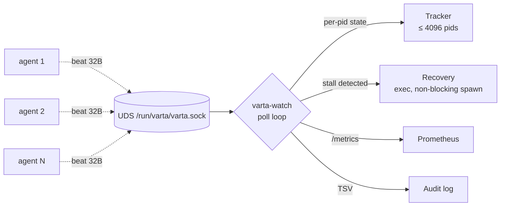

# Introduction

**Varta** is a zero-dependency, zero-allocation health protocol for
distributed local agents and networked clusters. Agents emit a fixed
32-byte heartbeat over a Unix domain socket (or UDP, with AEAD); an
observer (`varta-watch`) decodes the beats, detects stalls, fires
recovery commands, and exposes Prometheus metrics — all from a single
poll loop on a single thread, with no heap allocation on the steady-state
path.

## Should I use Varta?

| You're building… | Varta is a fit if… |
|---|---|
| **Safety-critical systems** (medical devices, robotics, industrial control) | You need bounded latency, no allocator surprises, and a structurally-excised attack surface (no HTTP server, no `/bin/sh`, no registry deps in the binary). |
| **High-density single-host fleets** (50–4096 local agents) | You want one low-cost observer per host, not a per-agent sidecar with its own runtime cost. |
| **Embedded targets** | `varta-vlp` is `#![no_std]`-clean. You want a wire format you can implement in C, Rust, Go, or Python from the same JSON test vectors. |
| **Operator-attested service meshes** | You want a heartbeat that's authenticated by the *kernel* (peer-cred PID) for local IPC, with an explicit refusal of recovery for any beat origin that isn't kernel-attested. |

Varta is **not** a tracing system, an APM, a load balancer, or a
config-distribution tool. It carries one fact per beat: *this PID is
alive, and here's how it feels about that*.

## The "Zero-Everything" philosophy

- **Zero registry dependencies.** Production crates
  (`varta-client`, `varta-watch`) have empty `[dependencies]` sections.
  The single exception is `varta-vlp`'s optional `crypto` feature.
- **Zero heap allocation** on the beat path after `Varta::connect()`.
  Every encode/decode operates on stack buffers. Enforced by a
  guard-allocator test in CI.
- **Non-blocking I/O.** The agent socket is non-blocking at connect
  time. `WouldBlock` is treated as `Dropped`, never as an error that
  stalls the caller.
- **Zero unsafe** in `varta-vlp` and `varta-client`; auditable, line-by-
  line opt-in unsafe in `varta-watch` for platform syscalls.

## How it works

1. **Agents** call `Varta::connect()` once, then `beat(status, payload)`
   on whatever cadence they like (typically every 100 ms – 1 s).
2. **The observer** polls the socket on a 100 ms read-timeout cadence,
   decodes frames on the stack, updates per-pid state, fires recovery
   commands for pids past their silence threshold, and serves
   `/metrics`. All on one thread.
3. **Recovery is opt-in and gated.** Only kernel-attested beats are
   eligible; UDP / socket-mode-only beats are refused with a labelled
   counter.

## Where to next

| Goal | Page |
|---|---|
| Ship `varta-watch` to a host now | [Install (Quickstart)](operations/install.md) |
| Wire metrics + alerts to Prometheus / Grafana | [Monitoring & Alerting](operations/monitoring.md) |
| Run on Kubernetes | [Helm Chart](operations/helm.md) |
| Implement the wire format in another language | [VLP — Base Frame](spec/vlp.md), [Conformance & Test Vectors](spec/conformance.md) |
| Understand the threat model | [Threat Model](architecture/threat-model.md) |
| Debug a production issue | [Troubleshooting](operations/troubleshooting.md) |
| Upgrade from v0.1.x | [Upgrade Guide](operations/upgrade.md) |
